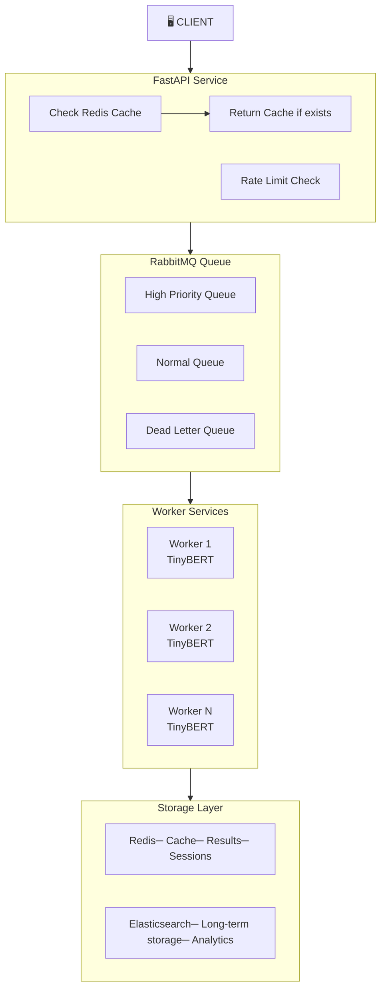

# Architecture

```mermaid
flowchart TD
    CLIENT["🖥️ CLIENT"]

    subgraph FastAPI["FastAPI Service"]
        direction LR
        A["Check Redis Cache"] --> B["Return Cache if exists"]
        C["Rate Limit Check"]
    end

    subgraph RabbitMQ["RabbitMQ Queue"]
        direction LR
        D["High Priority Queue"]
        E["Normal Queue"]
        F["Dead Letter Queue"]
    end

    subgraph Workers["Worker Services"]
        direction LR
        G["Worker 1\nTinyBERT"]
        H["Worker 2\nTinyBERT"]
        I["Worker N\nTinyBERT"]
    end

    subgraph Storage["Storage Layer"]
        direction LR
        J["Redis─ Cache─ Results─ Sessions"]
        K["Elasticsearch─ Long-term storage─ Analytics"]
    end

    CLIENT --> FastAPI
    FastAPI --> RabbitMQ
    RabbitMQ --> Workers
    Workers --> Storage
```
